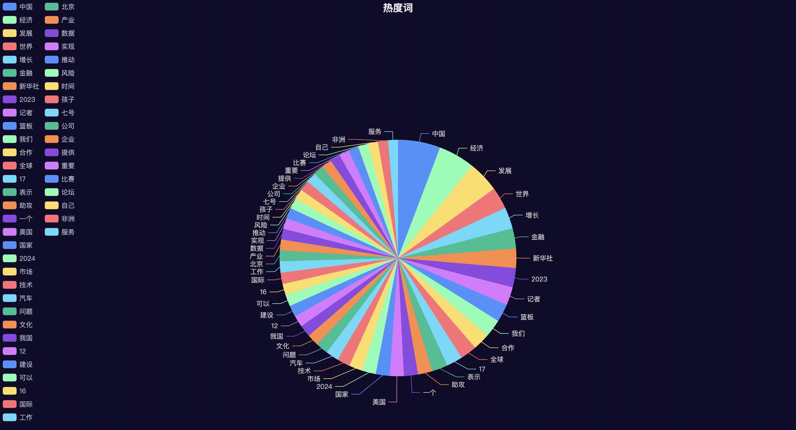

<video width="640" height="360" controls>
  <source src="./resources/项目介绍.mp4" type="video/mp4">
  Your browser does not support the video tag.
</video>

# [视频介绍](final/resources/项目介绍.mp4)

# 爬取新闻获得热度词的项目

# 首先爬取数据:
```bash
cd typescript
npm run dev
```
数据在
```typescript
            host: process.env.REDIS_HOST ? process.env.REDIS_HOST : '127.0.0.1', // Redis 服务器的主机地址
            port: process.env.REDIS_PORT ? parseInt(process.env.REDIS_PORT) : 6379, // Redis 服务器的端口号
            password: process.env.REDIS_PASSWORD ? process.env.REDIS_PASSWORD : 'Tjf04712', // Redis 服务器的密码（如果有的话）
            db: process.env.REDIS_DB ? parseInt(process.env.REDIS_DB) : 6,
```
的redis库里面

# 启动后端服务器
```bash
cd python
python -u main.py
```
将TF-IDF化的数据变为python/data/data.db储存，后端接口为:http://127.0.0.1:5000/api/data

```json
[
  {
    "tfidf": 12.498587980253891,
    "word": "\u4e2d\u56fd"
  },
  {
    "tfidf": 10.721016961436478,
    "word": "\u7ecf\u6d4e"
  },
  {
    "tfidf": 9.288529461261088,
    "word": "\u53d1\u5c55"
  },
  {
    "tfidf": 6.468125718534497,
    "word": "\u4e16\u754c"
  },
  {
    "tfidf": 6.319921041669984,
    "word": "\u589e\u957f"
  },
  {
    "tfidf": 5.901028670780271,
    "word": "\u91d1\u878d"
  },
  {
    "tfidf": 5.780974499209495,
    "word": "\u65b0\u534e\u793e"
  },
  {
    "tfidf": 5.707789187807525,
    "word": "2023"
  },
  {
    "tfidf": 5.372018573795428,
    "word": "\u8bb0\u8005"
  },
  {
    "tfidf": 5.3296187572064095,
    "word": "\u7bee\u677f"
  },
  {
    "tfidf": 5.295668008906416,
    "word": "\u6211\u4eec"
  },
  {
    "tfidf": 4.987841468218568,
    "word": "\u5408\u4f5c"
  },
  {
    "tfidf": 4.863780462975484,
    "word": "\u5168\u7403"
  },
  {
    "tfidf": 4.755483749161034,
    "word": "17"
  },
  {
    "tfidf": 4.692252653415313,
    "word": "\u8868\u793a"
  },
  {
    "tfidf": 4.22168868240817,
    "word": "\u52a9\u653b"
  },
  {
    "tfidf": 4.168573457535797,
    "word": "\u4e00\u4e2a"
  },
  {
    "tfidf": 4.120952807737789,
    "word": "\u7f8e\u56fd"
  },
  {
    "tfidf": 4.118547840307958,
    "word": "\u56fd\u5bb6"
  },
  {
    "tfidf": 4.060209678606764,
    "word": "2024"
  },
  {
    "tfidf": 3.995814742440595,
    "word": "\u5e02\u573a"
  },
  {
    "tfidf": 3.840371551952623,
    "word": "\u6280\u672f"
  },
  {
    "tfidf": 3.819216963781413,
    "word": "\u6c7d\u8f66"
  },
  {
    "tfidf": 3.590855924369751,
    "word": "\u95ee\u9898"
  },
  {
    "tfidf": 3.531370699548259,
    "word": "\u6587\u5316"
  },
  {
    "tfidf": 3.505539684547217,
    "word": "\u6211\u56fd"
  },
  {
    "tfidf": 3.4017260067758723,
    "word": "12"
  },
  {
    "tfidf": 3.3983332680597513,
    "word": "\u5efa\u8bbe"
  },
  {
    "tfidf": 3.3656673560504933,
    "word": "\u53ef\u4ee5"
  },
  {
    "tfidf": 3.35656023337404,
    "word": "16"
  },
  {
    "tfidf": 3.352263282688765,
    "word": "\u56fd\u9645"
  },
  {
    "tfidf": 3.345656595031763,
    "word": "\u5de5\u4f5c"
  },
  {
    "tfidf": 3.209302155940928,
    "word": "\u5317\u4eac"
  },
  {
    "tfidf": 3.1900443373559195,
    "word": "\u4ea7\u4e1a"
  },
  {
    "tfidf": 3.1765465680484453,
    "word": "\u6570\u636e"
  },
  {
    "tfidf": 3.168178125394951,
    "word": "\u5b9e\u73b0"
  },
  {
    "tfidf": 3.159460490724486,
    "word": "\u63a8\u52a8"
  },
  {
    "tfidf": 3.0926868541355477,
    "word": "\u98ce\u9669"
  },
  {
    "tfidf": 3.07282567168415,
    "word": "\u65f6\u95f4"
  },
  {
    "tfidf": 3.0650075215233357,
    "word": "\u5b69\u5b50"
  },
  {
    "tfidf": 3.0551816721563014,
    "word": "\u4e03\u53f7"
  },
  {
    "tfidf": 3.007185475561405,
    "word": "\u516c\u53f8"
  },
  {
    "tfidf": 3.0070605815900344,
    "word": "\u4f01\u4e1a"
  },
  {
    "tfidf": 3.005754867123644,
    "word": "\u63d0\u4f9b"
  },
  {
    "tfidf": 3.002909535132859,
    "word": "\u91cd\u8981"
  },
  {
    "tfidf": 2.9767903993440346,
    "word": "\u6bd4\u8d5b"
  },
  {
    "tfidf": 2.9645091471965146,
    "word": "\u8bba\u575b"
  },
  {
    "tfidf": 2.957010233660873,
    "word": "\u81ea\u5df1"
  },
  {
    "tfidf": 2.945772131214805,
    "word": "\u975e\u6d32"
  },
  {
    "tfidf": 2.943759247390922,
    "word": "\u670d\u52a1"
  }
]
```

# 启动前端
```bash
cd view
npm run dev
```

