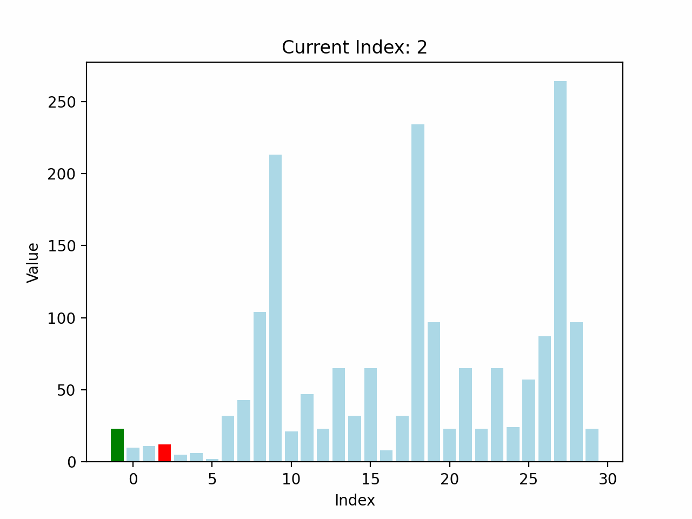

<!--
 * @Description: 
 * @Author: 唐健峰
 * @Date: 2023-10-16 17:56:18
 * @LastEditors: ${author}
 * @LastEditTime: 2023-10-16 18:52:48
-->
# [第一题](./cloud/duringbug/one.py)

# [第二题](./index.py)
```
import time
import timeit
```
# [第三题](./cloud/duringbug/two.py)


# [第四题](./cloud/duringbug/four.py)
时间复杂度：
- 希尔排序的最坏情况时间复杂度可以达到 $O(n^2)$，其中 $n$ 是待排序的元素数量。这发生在使用一些不好的间隔序列时。
- 但是，希尔排序通常比插入排序更快，因为它通过在数组中较远的元素之间交换来更快地将小的元素移向数组的一端。在平均情况下，希尔排序的时间复杂度通常在 $O(n^{1.3})$ 到 $O(n^2)$ 之间。

空间复杂度：
- 希尔排序是一种不需要额外空间的原地排序算法，因此它的空间复杂度是 $O(1)$。希尔排序仅使用了常数级别的额外内存来存储临时变量和控制循环所需的变量，而不会随着输入规模的增加而增加。